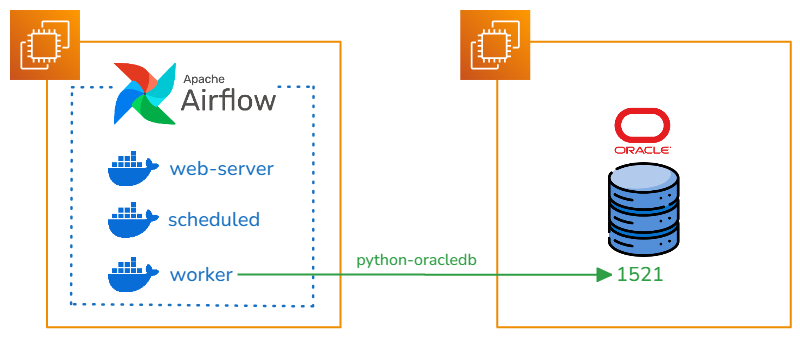

# Airflow To Oracle (AWS)

## Intro
In the world of data orchestration, Apache Airflow has become a fundamental tool for workflow automation and scheduling. However, when we face the need to integrate legacy systems or older versions of enterprise databases, we can encounter significant technical challenges.
One of these common challenges is connecting to Oracle Database 11, a version that, although older, is still widely used in many organizations due to its robustness and stability. While Airflow provides providers to connect to different databases, including Oracle, connecting to Oracle 11 presents a particularity: it requires the installation of the Oracle Instant Client with its specific system files.
This technical requirement can become an obstacle, especially when working in containerized environments where we need to ensure that all dependencies are properly configured and consistent across all deployments.
In this guide, we will address step by step how to overcome this challenge through:

- Creating a custom Airflow image that includes the Oracle Instant Client
- Proper configuration of necessary libraries and dependencies
- Installation and configuration of the Oracle provider for Airflow
- Establishing a functional and robust connection with Oracle 11

This solution will not only allow us to connect Airflow with Oracle 11 effectively, but will also ensure a reproducible and maintainable configuration over time.

## Connection Diagram
We present the connection model for [Airflow](https://airflow.apache.org/docs/) to Oracle 11, through the Oracle Provider that uses the [python-oracledb](https://python-oracledb.readthedocs.io/en/latest/index.html#) library.

To use the Oracle client in the python-oracledb library, we need to prepare the docker image with the Oracle Linux binaries and the Instant Client.

## Oracle Instant Client
Oracle Instant Client is a set of libraries that allows applications to connect and access Oracle databases without needing to install the complete Oracle Database software. It is a lightweight solution that provides the necessary client functionality for applications that communicate with Oracle databases.

In the following documentation we can view all the images that Oracle provides for Docker.

[GitHub Oracle Docker](https://github.com/oracle/docker-images)

In the [Instant Client](https://github.com/oracle/docker-images/tree/main/OracleInstantClient) section we can obtain information about which driver allows connection to the Oracle version.
In our case we need to create an Oracle Instant Client 19.23 image.

### Dockerfile
In the following dockerfile we use an Oracle Linux 7 Slim image to install our Instant Client 19.23.
```dockerfile
FROM oraclelinux:7-slim

ARG release=19
ARG update=23

RUN  yum -y install oracle-release-el7 && \
     yum -y install oracle-instantclient${release}.${update}-basic oracle-instantclient${release}.${update}-devel oracle-instantclient${release}.${update}-sqlplus && \
     rm -rf /var/cache/yum

# Uncomment if the tools package is added
# ENV PATH=$PATH:/usr/lib/oracle/${release}.${update}/client64/bin

CMD ["sqlplus", "-v"]
```
We perform the corresponding Build
```sh
docker build -t oracle/instantclient:19 .
```
With the generated image we can perform a query directly to Oracle using sqlplus.
```
docker run -it --rm oracle/instantclient:19 sqlplus user/password@host:port/service
```

## Airflow Image
Apache Airflow has established itself as one of the most powerful and versatile tools in the orchestration ecosystem, allowing organizations to automate, schedule and monitor complex workflows through its intuitive interface and flexibility in defining DAGs (Directed Acyclic Graphs) using Python. Since version 2.0, Airflow introduced an official Docker image that revolutionized the way teams deploy and scale their orchestration environments. This image, actively maintained by the Apache community, comes preconfigured with security and performance best practices, including a local executor by default and a PostgreSQL database for metadata.
[Airflow Docker Images Versions](https://hub.docker.com/r/apache/airflow/tags)

We create the corresponding requirements.txt with the Oracle Provider
```requirements.txt
apache-airflow-providers-oracle
```
We download the dependency constraint file, allowing the corresponding versions to be installed for the chosen Airflow and Python version.
```bash
#!/bin/bash
# download_constraints.sh

AIRFLOW_VERSION="2.10.3"
PYTHON_VERSION="3.12"

curl -Lo constraints.txt "https://raw.githubusercontent.com/apache/airflow/constraints-${AIRFLOW_VERSION}/constraints-${PYTHON_VERSION}.txt"
```
We select Airflow version 2.10.3 today to generate the new image with the Oracle Provider and the Instant Client copy.
```dockerfile
FROM apache/airflow:2.10.3

USER root
# Install necessary dependencies for Oracle Client
RUN apt-get update \
  && apt-get install -y --no-install-recommends \
         libaio1 \
         libaio-dev \
  && apt-get autoremove -yqq --purge \
  && apt-get clean \
  && rm -rf /var/lib/apt/lists/*

# Copy Oracle Instant Client (necessary for the provider) from the previously built Image
RUN mkdir -p /opt/oracle
COPY --from=oracle/instantclient:19 /usr/lib/oracle/19.23/client64/lib/* /opt/oracle/
ENV LD_LIBRARY_PATH=/opt/oracle:$LD_LIBRARY_PATH


USER airflow
# Copy requirements and constraints
COPY --chown=airflow:airflow requirements.txt .
COPY --chown=airflow:airflow constraints.txt .

# Install Python dependencies using requirements and constraints
RUN pip install --no-cache-dir -r requirements.txt --constraint constraints.txt

```
We build the Airflow image
```sh
docker build -t apache/airflow-oracle:2.10.3 .
```
The built image has the Oracle Provider, plus the necessary libraries to connect to Oracle 11.

## Airflow Docker Compose
We use the [Airflow](https://airflow.apache.org/docs/apache-airflow/stable/howto/docker-compose/index.html) documentation to build the environment with Docker Compose.
```sh
curl -LfO 'https://airflow.apache.org/docs/apache-airflow/2.10.3/docker-compose.yaml'
```
We only need to modify the environment variable in the docker compose with the built image.
```docker-compose.yaml
# AIRFLOW_IMAGE_NAME           - Docker image name used to run Airflow.
  image: ${AIRFLOW_IMAGE_NAME:-apache/airflow-oracle:2.10.3}
```
Perform the corresponding commands to start the service.
```sh
# Create folders
mkdir -p ./dags ./logs ./plugins ./config
# Save current User to Airflow User ID variable
echo -e "AIRFLOW_UID=$(id -u)" > .env
# Start Airflow
docker compose up airflow-init
# Deploy Airflow Services
docker compose up -d
```
## Airflow Connections
Access the Airflow web interface:

URL: http://localhost:8080
Default user: airflow
Default password: airflow

Navigation to Connections

In the top menu, click "Admin"
Select "Connections" in the dropdown menu

Creating New Connection
Step 1: Start New Connection

Click the "+ Add a new record" or "Create" button

Step 2: Basic Configuration
Complete the following required fields:
```oracleConn
Connection Id: oracle_default
Connection Type: Oracle
Host: your_oracle_host (example: 192.168.1.100)
Schema: your_schema (example: SYSTEM)
Login: your_user
Password: your_password
Port: 1521
```
## Airflow DAG
We build a DAG that allows us to connect to Oracle 11 through the SqlToS3 Operator, storing the records in an AWS S3 bucket.
When starting the DAG, the OracleDB module must be imported, which allows us to connect to the Oracle Client

```python
from datetime import datetime, timedelta
from airflow import DAG
from airflow.providers.amazon.aws.transfers.sql_to_s3 import SqlToS3Operator
from airflow.providers.oracle.operators.oracle import OracleOperator
import oracledb
oracledb.init_oracle_client()
# Default arguments
default_args = {
    'owner': 'airflow',
    'depends_on_past': False,
    'email_on_failure': False,
    'email_on_retry': False,
    'retries': 1,
    'retry_delay': timedelta(minutes=5)
}
# DAG definition
dag = DAG(
    'oracle_to_s3_transfer',
    default_args=default_args,
    description='Transfer data from Oracle table to S3',
    schedule_interval='0 0 * *',  # Run daily at midnight
    start_date=datetime(2024, 11, 8),
    catchup=False
)
# Configuration variables
ORACLE_CONN_ID = {CONNECTION_ID_ORACLE}
S3_CONN_ID = {CONNECTION_ID_S3}
SCHEMA = {SCHEMA}
TABLE = {TABLE}
S3_BUCKET = {BUCKET}
S3_KEY = f'data/{TABLE}/{{{{ ds }}}}/{TABLE}.csv'  # Will use execution date in path
# Task to validate that table exists and has data
check_table = OracleOperator(
    task_id='validate_oracle_table',
    oracle_conn_id=ORACLE_CONN_ID,
    sql=f"""
        SELECT COUNT()
        FROM {SCHEMA}.{TABLE}
        WHERE ROWNUM = 1
    """,
    dag=dag
)
# Main task to copy data
copy_to_s3 = SqlToS3Operator(
    task_id='transfer_oracle_to_s3',
    sql_conn_id=ORACLE_CONN_ID,
    aws_conn_id=S3_CONN_ID,
    query=f"""
        SELECT *
        FROM {SCHEMA}.{TABLE}
    """,
    s3_bucket=S3_BUCKET,
    s3_key=S3_KEY,
    replace=True,  # Replace file if it already exists
    file_format='csv',  # Can change to 'json' if preferred
    pd_kwargs={
        'index': False,
        'header': True
    },
    dag=dag
)
# Define execution order
check_table >> copy_to_s3
```
We execute the DAG and can view the data loaded in the s3 bucket.
