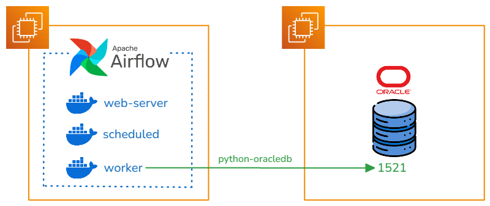

# Airflow To Oracle

## Intro
En el mundo de la orquestación de datos, Apache Airflow se ha convertido en una herramienta fundamental para la automatización y programación de flujos de trabajo. Sin embargo, cuando nos enfrentamos a la necesidad de integrar sistemas heredados o versiones anteriores de bases de datos empresariales, podemos encontrar desafíos técnicos significativos.
Uno de estos desafíos comunes es la conexión con Oracle Database 11, una versión que, aunque más antigua, sigue siendo ampliamente utilizada en muchas organizaciones debido a su robustez y estabilidad. Si bien Airflow proporciona providers para conectarse a diferentes bases de datos, incluyendo Oracle, la conexión a Oracle 11 presenta una particularidad: requiere la instalación del Oracle Instant Client con sus archivos de sistema específicos.
Este requisito técnico puede convertirse en un obstáculo, especialmente cuando trabajamos en entornos containerizados donde necesitamos asegurar que todas las dependencias estén correctamente configuradas y sean consistentes en todos los despliegues.
En esta guía, abordaremos paso a paso cómo superar este desafío mediante:

- La creación de una imagen personalizada de Airflow que incluya el Oracle Instant Client
- La configuración adecuada de las librerías y dependencias necesarias
- La instalación y configuración del provider de Oracle para Airflow
- El establecimiento de una conexión funcional y robusta con Oracle 11

Esta solución no solo nos permitirá conectar Airflow con Oracle 11 de manera efectiva, sino que también nos asegurará una configuración reproducible y mantenible en el tiempo.

## Diagrama de conexión
Presentamos el modelo de conexión para [Airflow](https://airflow.apache.org/docs/) a Oracle 11, por medio del Provider Oracle que utiliza la libreria [python-oracledb](https://python-oracledb.readthedocs.io/en/latest/index.html#).

Para poder utilizar el cliente de Oracle en la libreria de python-oracledb, tenemos que preparar la imagen de docker con los binarios de Oracle Linux y el Instant Client

## Oracle Instant Client
Oracle Instant Client es un conjunto de bibliotecas que permite a las aplicaciones conectarse y acceder a bases de datos Oracle sin necesidad de instalar el software completo de Oracle Database. Es una solución ligera que proporciona la funcionalidad cliente necesaria para aplicaciones que se comunican con bases de datos Oracle.

En la siguiente documentación podemos visualizar todas las imagenes que provee Oracle para Docker.

[GitHub Oracle Docker](https://github.com/oracle/docker-images)

En la seccion de [Instant Client](https://github.com/oracle/docker-images/tree/main/OracleInstantClient) podemos obtener la informacion que driver permite conectarse a la version de Oracle.
En nuestro caso necesitamos crear una imagen de Oracle Instant Cliente 19.23.

### Dockerfile
En el siguiente dockerfile utilizamos una imagen de Oracle Linux 7 Slim para instalar nuestro Instant Client 19.23.
```dockerfile
FROM oraclelinux:7-slim

ARG release=19
ARG update=23

RUN  yum -y install oracle-release-el7 && \
     yum -y install oracle-instantclient${release}.${update}-basic oracle-instantclient${release}.${update}-devel oracle-instantclient${release}.${update}-sqlplus && \
     rm -rf /var/cache/yum

# Uncomment if the tools package is added
# ENV PATH=$PATH:/usr/lib/oracle/${release}.${update}/client64/bin

CMD ["sqlplus", "-v"]
```
Realizamos el corespondiente Build
```sh
docker build -t oracle/instantclient:19 .
```
La imagen generada podemos realizar una consulta directamente al oracle utilizando sqlplus.
```
docker run -it --rm oracle/instantclient:19 sqlplus usuario/password@host:puerto/servicio
```

## Airflow Image
Apache Airflow se ha consolidado como una de las herramientas más potentes y versátiles en el ecosistema de orquestación, permitiendo a las organizaciones automatizar, programar y monitorear flujos de trabajo complejos a través de su interfaz intuitiva y su flexibilidad en la definición de DAGs (Directed Acyclic Graphs) usando Python. A partir de su versión 2.0, Airflow introdujo una imagen oficial de Docker que revolucionó la forma en que los equipos despliegan y escalan sus entornos de orquestación. Esta imagen, mantenida activamente por la comunidad de Apache, viene preconfigurada con las mejores prácticas de seguridad y rendimiento, incluyendo un ejecutor local por defecto y una base de datos PostgreSQL para la metadata.
[Versiones de Docker Images Airflow](https://hub.docker.com/r/apache/airflow/tags)

Creamos el requirements.txt correspondiente con el Provider de Oracle
```requirements.txt
apache-airflow-providers-oracle
```
Descargamos el archivo de restriccion para dependencias, permitiendo que se instale las versiones correspondientes en la Version de Airflow y Python elegida.
```bash
#!/bin/bash
# download_constraints.sh

AIRFLOW_VERSION="2.10.3"
PYTHON_VERSION="3.12"

curl -Lo constraints.txt "https://raw.githubusercontent.com/apache/airflow/constraints-${AIRFLOW_VERSION}/constraints-${PYTHON_VERSION}.txt"
```
Seleccionamos al dia de hoy la version de Airflow 2.10.3 para generar la nueva imagen con el Provider Oracle y la copia del Instant Client.
```dockerfile
FROM apache/airflow:2.10.3

USER root
# Instalar dependencias necesarias para Oracle Client
RUN apt-get update \
  && apt-get install -y --no-install-recommends \
         libaio1 \
         libaio-dev \
  && apt-get autoremove -yqq --purge \
  && apt-get clean \
  && rm -rf /var/lib/apt/lists/*

# Copiar Oracle Instant Client (necesario para el provider) de la Imagen buildeada anteriormente
RUN mkdir -p /opt/oracle
COPY --from=oracle/instantclient:19 /usr/lib/oracle/19.23/client64/lib/* /opt/oracle/
ENV LD_LIBRARY_PATH=/opt/oracle:$LD_LIBRARY_PATH


USER airflow
# Copiar requirements y constraints
COPY --chown=airflow:airflow requirements.txt .
COPY --chown=airflow:airflow constraints.txt .

# Instalar dependencias de Python usando requirements y constraints
RUN pip install --no-cache-dir -r requirements.txt --constraint constraints.txt

```
Construimos la imagen de Airflow
```sh
docker build -t apache/airflow-oracle:2.10.3 .
```
La imagen construida tiene el Provider de Oracle, mas las librerias necesarias para conectarse al Oracle 11.

## Airflow Docker Compose
Utilizamos la documentación de [Airflow](https://airflow.apache.org/docs/apache-airflow/stable/howto/docker-compose/index.html) para construir el entorno con Docker Compose.
```sh
curl -LfO 'https://airflow.apache.org/docs/apache-airflow/2.10.3/docker-compose.yaml'
```
Solo tenemos que modificar la variable de entorno en el docker compose por la imagen construida.
```docker-compose.yaml
# AIRFLOW_IMAGE_NAME           - Docker image name used to run Airflow.
  image: ${AIRFLOW_IMAGE_NAME:-apache/airflow-oracle:2.10.3}
```
Realiza los comandos correspondientes para el inicio del servicio.
```sh
# Creacion de carpetas
mkdir -p ./dags ./logs ./plugins ./config
# Guardado de Usuario actual a la variable de User ID de Airflow
echo -e "AIRFLOW_UID=$(id -u)" > .env
# Inicio de Airflow
docker compose up airflow-init
# Despliegue de Servicios de Airflow
docker compose up -d
```
## Airflow Connections
Accede a la interfaz web de Airflow:

URL: http://localhost:8080
Usuario por defecto: airflow
Contraseña por defecto: airflow

Navegación a Connections

En el menú superior, haz clic en "Admin"
Selecciona "Connections" en el menú desplegable

Creación de Nueva Conexión
Paso 1: Iniciar Nueva Conexión

Haz clic en el botón "+ Add a new record" o "Create"

Paso 2: Configuración Básica
Completa los siguientes campos obligatorios:
```oracleConn
Connection Id: oracle_default
Connection Type: Oracle
Host: tu_host_oracle (ejemplo: 192.168.1.100)
Schema: tu_schema (ejemplo: SYSTEM)
Login: tu_usuario
Password: tu_password
Port: 1521
```
## Airflow DAG
Construimos un DAG que nos permita conectarnos al Oracle 11 por medio del Operator SqltoS3, almacenando los registros en un bucket S3 de AWS.
En el momento de iniciar el DAG se debe importar el modulo de OracleDB que nos permite conectarnos al Client Oracle

```python
from datetime import datetime, timedelta
from airflow import DAG
from airflow.providers.amazon.aws.transfers.sql_to_s3 import SqlToS3Operator
from airflow.providers.oracle.operators.oracle import OracleOperator
import oracledb
oracledb.init_oracle_client()
# Default arguments
default_args = {
    'owner': 'airflow',
    'depends_on_past': False,
    'email_on_failure': False,
    'email_on_retry': False,
    'retries': 1,
    'retry_delay': timedelta(minutes=5)
}
# DAG definition
dag = DAG(
    'oracle_to_s3_transfer',
    default_args=default_args,
    description='Transfer data from Oracle table to S3',
    schedule_interval='0 0 * *',  # Ejecutar diariamente a medianoche
    start_date=datetime(2024, 11, 8),
    catchup=False
)
# Variables para configurar
ORACLE_CONN_ID = {CONNECTION_ID_ORACLE}
S3_CONN_ID = {CONNECTION_ID_S3}
SCHEMA = {SCHEMA}
TABLE = {TABLE}
S3_BUCKET = {BUCKET}
S3_KEY = f'data/{TABLE}/{{{{ ds }}}}/{TABLE}.csv'  # Usará la fecha de ejecución en el path
# Task para validar que la tabla existe y tiene datos
check_table = OracleOperator(
    task_id='validate_oracle_table',
    oracle_conn_id=ORACLE_CONN_ID,
    sql=f"""
        SELECT COUNT()
        FROM {SCHEMA}.{TABLE}
        WHERE ROWNUM = 1
    """,
    dag=dag
)
# Task principal para copiar datos
copy_to_s3 = SqlToS3Operator(
    task_id='transfer_oracle_to_s3',
    sql_conn_id=ORACLE_CONN_ID,
    aws_conn_id=S3_CONN_ID,
    query=f"""
        SELECT *
        FROM {SCHEMA}.{TABLE}
    """,
    s3_bucket=S3_BUCKET,
    s3_key=S3_KEY,
    replace=True,  # Reemplazar el archivo si ya existe
    file_format='csv',  # Puedes cambiar a 'json' si prefieres
    pd_kwargs={
        'index': False,
        'header': True
    },
    dag=dag
)
# Definir el orden de ejecuci├│n
check_table >> copy_to_s3
```
  Ejecutamos el DAG y podemos visualizar los datos cargados en el bucket s3.

Concluimos con el DAG
